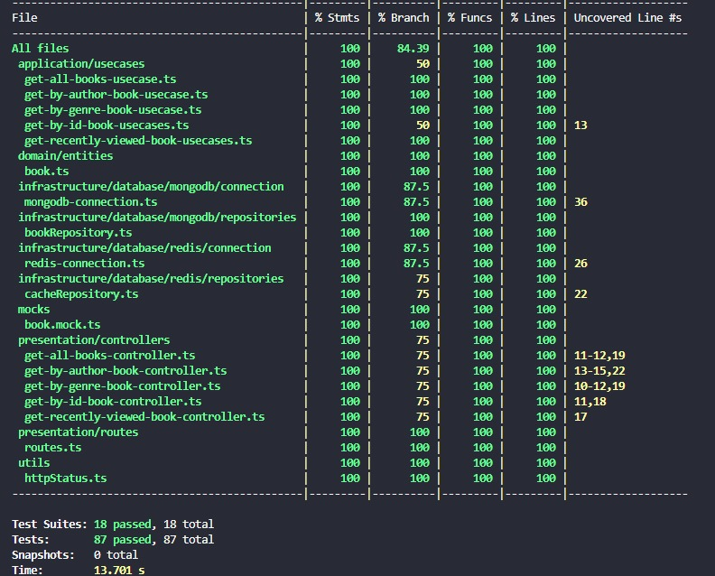

# 📘 Code Elevate - Catálogo de livros

### Autor: Airton Cordeiro da Silva

Esta API foi desenvolvida com o objetivo de buscar livros. Os endpoints desenvolvidos nela são responsáveis por buscar livros individualmente, listar todos os livros, buscar por gênero, buscar por autor e mostrar livros que foram recentemente acessados por usuários.

---

## I. Arquitetura de Solução e Arquitetura Técnica

### Detalhes do projeto

A API foi desenvolvida utilizando Node.js e Typescript:

1. Buscar todos os livros
2. Buscar livros por id
3. Buscar livros por gênero
4. Buscar livros por autor
5. Visualização dos livros recentemente visualizados

O serviço foi feito utilizando cache para alta performance e escalabilidade.

---

### 🚀 Como rodar o projeto

1. Tenha [Docker](https://www.docker.com/) e [Docker Compose](https://docs.docker.com/compose/) instalados na sua máquina.
2. Clone este repositório: `git clone https://github.com/Airton-Cordeiro/code-elevate.git`
3. Na pasta **raiz** rode o comando `docker-compose up --build -d`
   - Os contêineres `mongodb`, `redis` e `code-elevate-app` serão buildados e inicializados
4. O serviço pode ser acessado através do host http://localhost:8000 - Visualize o Swagger para todas as rotas na pasta /doc.

---

### ✅ Testes end-to-end/Automatizados

Os testes end-to-end foram feitos utilizando [Cypress](https://www.cypress.io/) e podem ser rodados via:

1. Entrar no diretório `code-elevate`
2. Via terminal rodar o comando `npm run cy:open`
3. Clicar em "E2E Testing"
4. Selecione o browser de sua preferência e clique no botão "Start E2E Testing in..."
5. Espere o navegador abrir e clique em "api_books.cy.js"
6. Os testes irão rodar automaticamente

---

### ✅ Testes unitários

<table>
  <tr>
    <th>Testes unitários</th>
  </tr>
  <tr>
    <td align="center">
      
    </td>
  </tr>
</table>

---

### 🛠️ Tecnologias Utilizadas

- **Linguagem:** [Typescript](https://www.typescriptlang.org/)
- **Framework:** [Express.js](https://expressjs.com/pt-br/)
- **Banco de Dados:** [MongoDB](https://www.mongodb.com/)
- **Cache:** [Redis](https://redis.io/)
- **Documentação da API:** [Swagger](https://swagger.io/)(OpenApi 3.0)
- **Ferramenta de Build:** [Typescript Compiler](https://www.typescriptlang.org/docs/handbook/compiler-options.html)
- **Containerização:** [Docker](https://www.docker.com/) e [Docker Compose](https://docs.docker.com/compose/)
- **Testes Unitários:** [Jest](https://jestjs.io/pt-BR/)
- **Controle de Versão:** Git + GitHub

---

### 🧱 Decisões de Design

#### _Clean Architecture_

- A aplicação foi projetada com base nos princípios da Clean Architecture, priorizando a modularidade, a facilidade de testes e a clara divisão de funções entre os componentes. As lógicas centrais do sistema estão desacopladas e se comunicam por meio de contratos (interfaces), o que garante flexibilidade para substituir tecnologias como banco de dados ou mecanismos de cache sem afetar o funcionamento principal.

Essa **inversão de dependência** permitiu:

- Facilidade na substituição de tecnologias (ex: MongoDB → PostgreSQL)
- Separação de responsabilidades
- Testes unitários facilitados por mocks
- Evolução e manutenção mais seguras

**⚠️ IMPORTANTE: A estrutura foi organizada nas seguintes camadas:⚠️**

- `Domain`: Define as entidades centrais do negócio (ex: Book), interfaces de repositórios e regras de validação.
- `Application`: Implementa os casos de uso (use cases) da aplicação, orquestrando as regras de negócio usando os repositórios definidos no domínio.
- `Infrastructure`: Implementa a persistência de dados e integrações externas como MongoDB e Redis.
- `Presentation`: Camada responsável por receber as requisições HTTP, chamar os casos de uso e retornar respostas.
- `Utils/Mocks/`: Funções utilitárias e dados e funções de mock para testes.
- `Testes`: Testes unitários e de integração em cada camada.
- `Doc`: Documentação da API no padrão OpenAPI/Swagger.
- `Infraestrutura de Deploy`: Orquestra containers de aplicação, MongoDB e Redis.

---

#### O banco de dados já está populado

Ao iniciar o projeto com Docker pela primeira vez, o container do MongoDB já será populado com **livros reais**. Isso garante que a API funcione de forma imediata com dados reais — veja mais na próxima seção.

---

## II. Explicação sobre o Case Desenvolvido (Plano de Implementação)

### Populando o banco de dados

Usando IA, formatei a estrutura de dados (Book) que eu queria e dei o comando para gerar livros com campos aleatórios, respeitando os tipos de dados fornecidos inicialmente. Como não precisava de imagens, pude simular as informações dos livros.

---

### 🧠 Entidade Livro (Modelo de Dados)

```typescript
// Modelo Book
Book {
  id: "1",
  title: "Livro Exemplo",
  subtitle: "Subtítulo Exemplo",
  author: "Autor Exemplo",
  publisher: "Editora Exemplo",
  publicationDate: "2023-01-01",
  language: "Português",
  genres: ["Ficção", "Aventura"],
  pages: 300,
  format: "Capa dura",
  description: "Descrição de exemplo do livro.",
  coverImageUrl: "https://exemplo.com/capa.jpg",
  price: 49.9,
  availability: "Disponível",
  averageRating: 4.5,
  tags: ["tag1", "tag2"],
  createdAt: "2023-01-01T00:00:00Z",
  updatedAt: "2023-01-02T00:00:00Z",
}
```

---

### Endpoints disponíveis

#### Swagger disponível na pasta doc ou no link abaixo

https://app.swaggerhub.com/apis/santander-8d6/Code-Elevate/1.0.0

| Endpoint                     | Descrição                                            |
| ---------------------------- | ---------------------------------------------------- |
| `GET /health`                | Health check da aplicação                            |
| `GET /books`                 | Retorna todos os livros (com paginação)              |
| `GET /books/:bookId`         | Busca livro por ID                                   |
| `GET /books/genre/:genre`    | Busca livros por gênero (com paginação)              |
| `GET /books/author/:author`  | Busca livros por autor (com paginação)               |
| `GET /books/recently-viewed` | Retorna os 10 últimos livros que o usuário pesquisou |

---

### Banco de dados MongoDB

Optei pelo MongoDB como banco de dados devido à sua flexibilidade de schema, o que facilita adaptações futuras no modelo dos livros, e também pela boa performance em consultas simples, que atendem perfeitamente às necessidades dos endpoints deste projeto.

---

## III. Melhorias e Considerações Finais

### Melhorias

1. Mais filtros como: filtros por avaliação, por preço e filtros combinados.
2. Monitoramento e observabilidade: identificar com base em métricas quais são os títulos/autores mais pesquisados para gerar recomendações ou relatórios como por exemplo usando o elasticsearch.
3. Implementar uma função para avisar o usuário quando o livro estiver disponível (em estoque) como por exemplo por e-mail o SendGrid.

---

### Considerações finais

O projeto Code Elevate - Catálogo de Livros demonstra uma arquitetura sólida, baseada em princípios de Clean Architecture, que facilita a manutenção, evolução e testabilidade do sistema. A separação clara entre as camadas de domínio, aplicação, infraestrutura e apresentação garante flexibilidade para futuras mudanças tecnológicas e ampliações de funcionalidades.
